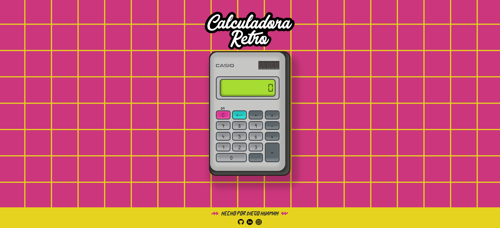
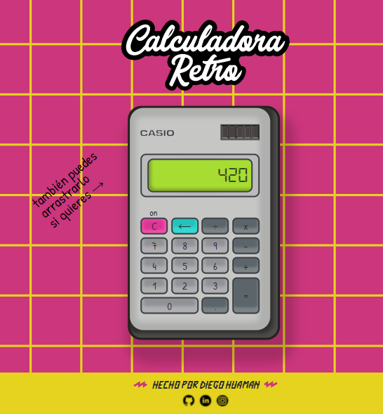
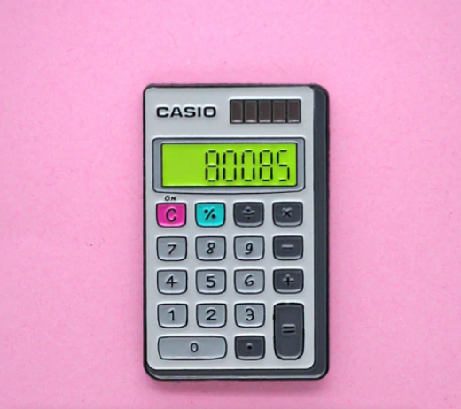

Calculadora Retro es una calculadora de bolsillo en la web con los botones retro, que seguirá esos 8 bits y evocar la nostalgia.

## Features \***\*⚙️\*\***

---

- Operaciones matemáticas básicas
- Almacenamiento en memoria virtual
- Drag and drop (en modo Desktop; pronto para mobile y tablet)
- Botones con sonido

## Imágenes del proyecto🖼️

---

Vista en desktop del proyecto.

Vista zoom del proyecto

Favicon del proyecto.

## Idea 🧠

---

### Inspiración ✨

La idea vino por una publicación que vi en internet de una marca de ropa que hizo una ilustración de esta calculador con estilo retro. Al mismo tiempo quería retarme a mi mismo al hacer una calculadora que sea visualmente atractiva y con un UI fluido para el usuario.

### Imagen referencial:

⌨️ con ❤️ por [Diego Huaman](https://github.com/darsico/) 😊

